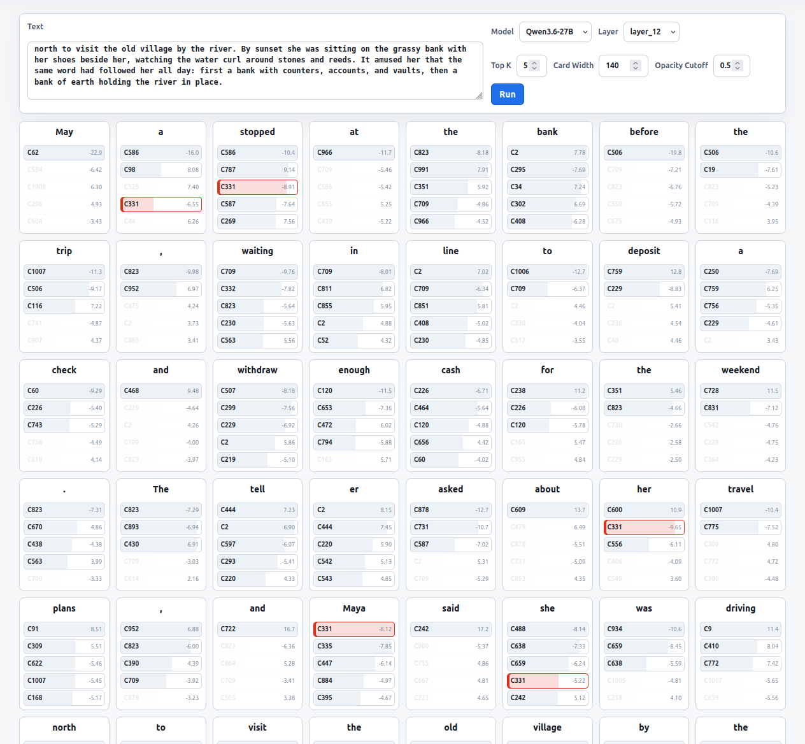

# Tutorial: Fit One ICA Layer for a new model (Qwen3.6-27B)

This tutorial shows a one-layer ICA fit for `Qwen/Qwen3.6-27B`. It has two
copy-paste paths: a 3k-token smoke test and a 1M-token exploratory run. Both
use text from `NeelNanda/pile-10k`, truncate each document to 1024 tokens, and
fit layer `layer_12`.

The model card describes Qwen3.6-27B as a 27B-parameter model with a vision
encoder, hidden dimension 5120, 64 language-model layers, and native 262k token
context. This tutorial fits ICA on text hidden states only. The required interface
is the same one used by the released ICA Lens models: load the model, run text
through the transformer, and sample residual-stream hidden states from text
documents. For explicit one-layer captures, the workflow uses a forward hook and
stops immediately after the requested layer.

Start with the 3k smoke test before spending time on the 1M-token run.

The final explorer view will look like this once the one-layer database is built:

<a href="images/explorer_qwen36_27b.png"></a>

## 1. Prepare the environment

Run only the dependencies needed for ICA fitting:

```bash
uv sync
git submodule update --init vendor/FastICA_torch
```

`vendor/FastICA_torch` is required by `workflows/02_fit_ica.py`.

A 27B bf16 model is large. The current loader places the whole model on one
resolved device; it does not use `device_map="auto"`, quantization, or tensor
parallelism. Use a large-memory GPU for this tutorial (tested on NVIDIA DGX Spark
with 128 GiB shared VRAM).

Resource rules of thumb for one layer with hidden size 5120, checked against
the `layer_12` runs below:

- Captured activation disk: about 9.6 GiB per 1M captured tokens in bf16. The
  actual 1M-token run wrote four layer shards totaling about 9.54 GiB, plus
  about 23 MiB of token/doc/position metadata.
- ICA artifact disk: the actual 1M-token, 1024-component fit wrote about 48 MiB
  for `layer_12_fastica.pt`. A full `d = 5120` artifact is expected to be much
  larger, roughly 0.4-0.6 GiB, because it stores full-size transform matrices.
- Explorer DB disk: the actual one-layer DB is about 80 MiB.
- Project-output disk to reserve: about 1 GiB for the 3k smoke test, and about
  15 GiB for the 1M-token, 1024-component run. Reserve disk separately for the
  Hugging Face model cache; the 27B bf16 weights are roughly 54 GiB before
  cache/index overhead.
- Fit memory lower bound: about 19.1 GiB per 1M tokens just for the selected
  layer as float32. Practical peak is much higher because fitting also keeps
  normalized data, source estimates, and FastICA work buffers.
- Model-loading memory: the 27B bf16 weights alone are roughly 54 GiB, before
  activations and framework overhead.

The 1M-token run with 1024 components is the practical target for this tutorial.
Use the 3k smoke test first to validate loading, capture, fitting, and explorer
DB construction.

For reference, `NeelNanda/pile-10k` contains about 5.26M Qwen tokens after
truncating each document to 1024 tokens. This tutorial intentionally exposes only
the 3k and 1M paths.

## 2. Choose 3k smoke test or 1M exploratory run

Pick exactly one option and keep using the same shell for the remaining commands.

For a fast smoke test:

```bash
mkdir -p results/qwen36_27b_one_layer
export TOKEN_BUDGET=3000
export ICA_N_COMPONENTS=32
```

For a 1M-token exploratory fit:

```bash
mkdir -p results/qwen36_27b_one_layer
export TOKEN_BUDGET=1000000
export ICA_N_COMPONENTS=1024
```

The 1M-token run also supports smaller settings such as `128`. In local
testing, `1024` fit successfully; treat larger settings such as `2048` or
`hidden_dim` as large-memory experiments, not the default path.

If you start a new shell, restore the same choice before continuing.

## 3. Write the three config files

Run this from the repository root:

```bash
mkdir -p configs/models configs/activations configs/fit_ica

cat > configs/models/qwen3_6_27b.toml <<'EOF'
[model]
short_name = "qwen3_6_27b"
id = "Qwen/Qwen3.6-27B"
hidden_size = 5120
num_hidden_layers = 64
context_length = 1024

[hooks]
residual_stream_template = "blocks.{layer}.hook_resid_post"
EOF

cat > configs/activations/qwen3_6_27b.toml <<EOF
[activation]
model_config = "../models/qwen3_6_27b.toml"
dataset_path = "NeelNanda/pile-10k"
dataset_split = "train"
text_column = "text"
token_budget = ${TOKEN_BUDGET}
seed = 0
activation_dtype = "bfloat16"
shard_token_budget = 250000
site = "residual_stream"
EOF

cat > configs/fit_ica/qwen3_6_27b.toml <<EOF
[fit]
activation_config = "../activations/qwen3_6_27b.toml"
preprocess = "with_normalization"
layers = ["layer_12"]
dtype = "float32"
seed = 0
max_iter = 1000
tol = 1e-4
algorithm = "parallel"
n_components = "${ICA_N_COMPONENTS}"
nonlinearity = "logcosh"
norm_eps = 1e-12
EOF
```

`layer_12` is the default layer for this tutorial. It is much faster than a
deeper layer such as `layer_30`, because hook capture stops immediately after
the requested block. The capture code names Qwen3.6-27B language-model hidden
states `layer_00` through `layer_63`.
With the 3k option, the generated fit config contains `n_components = "32"`.
This is only a pipeline smoke test: 3k tokens are not enough to reliably fit even
128 components. With 1M tokens, 128 components should be easy and 1024
components are the practical exploratory setting used by this tutorial.

## 4. Capture one layer of activations

```bash
uv run python workflows/01_capture_activations.py \
  --config configs/activations/qwen3_6_27b.toml \
  --output-root results/qwen36_27b_one_layer/activations \
  --token-budget "${TOKEN_BUDGET}" \
  --shard-token-budget 250000 \
  --layers layer_12 \
  --model-dtype bfloat16 \
  --device cuda \
  --force
```

Because `--layers layer_12` is explicit, capture uses a forward hook on block 12
and stops before running later blocks. It also avoids returning all hidden states
from the model.

This writes a manifest and one or more activation shards:

```text
results/qwen36_27b_one_layer/activations/qwen3_6_27b_tok${TOKEN_BUDGET}/manifest.json
results/qwen36_27b_one_layer/activations/qwen3_6_27b_tok${TOKEN_BUDGET}/layer_12/shard_*.pt
```

Check the manifest before fitting:

```bash
uv run python - <<'PY'
import json
import os
from pathlib import Path

token_budget = os.environ["TOKEN_BUDGET"]
manifest = Path(f"results/qwen36_27b_one_layer/activations/qwen3_6_27b_tok{token_budget}/manifest.json")
m = json.loads(manifest.read_text())
print(m["model"])
print(m["capture"]["layers"])
print(m["capture"].get("capture_backend"))
print(m["capture"]["captured_tokens"])
PY
```

## 5. Fit one ICA artifact

```bash
uv run python workflows/02_fit_ica.py \
  --config configs/fit_ica/qwen3_6_27b.toml \
  --activation-root results/qwen36_27b_one_layer/activations \
  --output-root results/qwen36_27b_one_layer/ica \
  --token-budget "${TOKEN_BUDGET}" \
  --layers layer_12 \
  --n-components "${ICA_N_COMPONENTS}" \
  --device cuda \
  --dtype float32 \
  --force
```

This writes:

```text
results/qwen36_27b_one_layer/ica/qwen3_6_27b_tok${TOKEN_BUDGET}/layer_12_fastica.pt
results/qwen36_27b_one_layer/ica/qwen3_6_27b_tok${TOKEN_BUDGET}/layer_12_fastica.json
results/qwen36_27b_one_layer/ica/qwen3_6_27b_tok${TOKEN_BUDGET}/manifest.json
```

The JSON sidecar records the activation shape, preprocessing mode, seed, and
FastICA settings. Keep it with the `.pt` file; the explorer and SAEBench adapter
expect the artifact and metadata to travel together.

## 6. Build an explorer DB and view it

Build a one-layer explorer database from the captured activations and fitted ICA
artifact. This stores top component examples, not all scores:

```bash
uv run python workflows/04_build_explorer_db.py \
  --models qwen3_6_27b \
  --layers layer_12 \
  --token-budget "${TOKEN_BUDGET}" \
  --activation-root results/qwen36_27b_one_layer/activations \
  --ica-root results/qwen36_27b_one_layer/ica \
  --output-db results/qwen36_27b_one_layer/databases/ica_probe_qwen36_27b.sqlite \
  --examples-per-region 5 \
  --max-tokens "${TOKEN_BUDGET}" \
  --device cuda \
  --force
```

Then launch the explorer against that database and the newly fitted one-layer ICA
artifact directory:

```bash
ICA_EXPLORER_DB_PATH=results/qwen36_27b_one_layer/databases/ica_probe_qwen36_27b.sqlite \
ICA_EXPLORER_ICA_DIR=results/qwen36_27b_one_layer/ica/qwen3_6_27b_tok${TOKEN_BUDGET} \
ICA_EXPLORER_MODEL_NAME=qwen3_6_27b \
ICA_EXPLORER_MODEL_ID=Qwen/Qwen3.6-27B \
ICA_EXPLORER_DISPLAY_NAME=Qwen3.6-27B \
ICA_EXPLORER_CONTEXT_LENGTH=1024 \
ICA_EXPLORER_DTYPE=bfloat16 \
ICA_EXPLORER_DOWNLOAD_MISSING=0 \
uv run python -m server.app --port 8001
```

Open `http://127.0.0.1:8001`. You should see `qwen3_6_27b` in the model picker
with `layer_12` components and their top positive/negative examples.

This launch command is intentionally local-only. `ICA_EXPLORER_DOWNLOAD_MISSING=0`
prevents the server from trying to fetch released artifacts while you inspect the
new one-layer run.

## 7. After the one-layer run

Once the one-layer run works:

1. If the 3k smoke test worked, rerun the same tutorial with
   `TOKEN_BUDGET=1000000` and `ICA_N_COMPONENTS=1024`.
2. Increase `--examples-per-region` when you want denser explorer examples.
3. Add more layers with `--layers layer_16 layer_30 layer_47`, then eventually
   use all layers.
